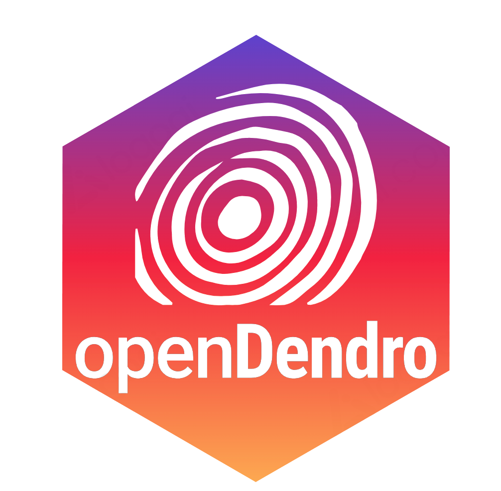

[](https://www.repostatus.org/#wip) [](https://opensource.org/licenses/GPL-3.0) 
<a href="https://doi.org/10.5281/zenodo.6110787"></a>


[](https://nsf.gov/awardsearch/showAward?AWD_ID=2054514)
[](https://nsf.gov/awardsearch/showAward?AWD_ID=2054515)
[](https://nsf.gov/awardsearch/showAward?AWD_ID=2054516)

{width=250}

Code, example data, and manuscript supplemental materials which accompany **openDendro**

Lead Author: [Andy Bunn](https://github.com/AndyBunn/) [](http://orcid.org/0000-0001-9027-2162)

Co-Authors: [Ed Cook](https://scholar.google.com/citations?user=F7jhxf4AAAAJ&hl=en&oi=sra), [Kevin Anchukaitis](http://www.u.arizona.edu/~kanchukaitis/) [](http://orcid.org/0000-0002-8509-8080),  [Tyson Lee Swetnam](https://tyson-swetnam.github.io/) [](http://orcid.org/0000-0002-6639-7181)

## Welcome
Welcome to openDendro, the home of an open-source framework for the essential analytic software used in dendrochronology. Our aim is to provide researchers working with tree-ring data the necessary tools in open-source environments, promoting open science practices, and enhancing rigor and transparency in dendrochronology.

At openDendro, we recognize the importance of these foundational tools in advancing scientific knowledge, enabling collaboration, reproducibility, and the collective progress of the dendrochronology community. Our framework seamlessly integrates with popular programming languages R and Python, accommodating diverse researchers' preferences and workflows, while embracing open-source principles to foster innovation and facilitate the sharing of knowledge within the field.


### History and Motivation
For decades, much of the software used in dendrochronology has been in legacy programming languages which have been maintained by a small number of volunteers. These codebases are at risk of becoming inoperable or incompatible as advances in computing architecture accelerate. This is colloquially known as the "Some random guy in Nebraska" problem in homage to a cartoon from xckd.


Our motivation with this project is to develop and foster a community of developers to maintain and build open-source software that will be usable by researchers who use tree-ring data. Modernizing and enhancing this software will also extend both their reach and utility beyond the dendrochronology community and allow integration into related initiatives in the atmospheric and earth sciences. We hope that making these tools open source will also facilitate further collaborative development, broaden the responsibility for collective maintenance and enhancement of this software, and ensure the persistence of these  tools. 

### Why Write Code?

Writing code in languages like Python or R makes reproducible science easier compared to GUI-based analysis. Scripting offers transparency, automation, replication, portability, extensibility, and version control, which enhance reproducibility in scientific research.

+ Transparency and Documentation: Scripts are plain-text files that document the analysis workflow, making it easier for other researchers to understand and reproduce the analysis. GUI-based analysis lacks clear documentation of the steps and parameters used.

+ Automation and Efficiency: Scripts automate repetitive tasks, saving time and reducing human errors. Code snippets, functions, and libraries can be reused across multiple datasets or scenarios, ensuring efficient and consistent analysis.

+ Replication: Scripts facilitate straightforward replication of analyses. Other researchers can run the script on their own machines with the same input data and obtain identical results. GUI-based analysis often requires recreating specific interactions and settings, which is error-prone and time-consuming.

+ Portability and Compatibility: Scripts in Python or R are portable and can run on different platforms without significant modifications. GUI-based tools may have platform-specific dependencies or version requirements, limiting their portability and compatibility.

+ Extensibility and Flexibility: Scripting languages provide a wide range of libraries, packages, and modules, enabling advanced analyses, integration with external tools, and customization. GUI-based tools often have limited built-in functionality, making extension and adaptation challenging.

+ Version Control: Scripts can easily integrate with version control systems like Git, allowing researchers to track changes, collaborate, and maintain an analysis history. Version control enhances transparency and ensures reproducibility.

By leveraging scripting and sharing code, researchers can promote collaboration, verification, and efficient building upon each other's work in scientific research.

## Getting Started

Those working or interested in `R` can begin [here](r.md) or jump straight into [Learning to Love dplR](https://opendendro.github.io/dplR-workshop/)

Users of Python can being [here](python.md)

## FAIR

The repository is organized (in the attempt) to enable reproducible research as part of the [FAIR data principles](https://www.go-fair.org/fair-principles/).

You can (re)run these analyses using your own computer, on commercial cloud, or a data science workbench [CyVerse](https://cyverse.org) Discovery Environment.

Clone the repo to your local or VM:

```
git clone https://github.com/opendendro/opendendro
```

```
gh repo clone opendendro/opendendro
```
