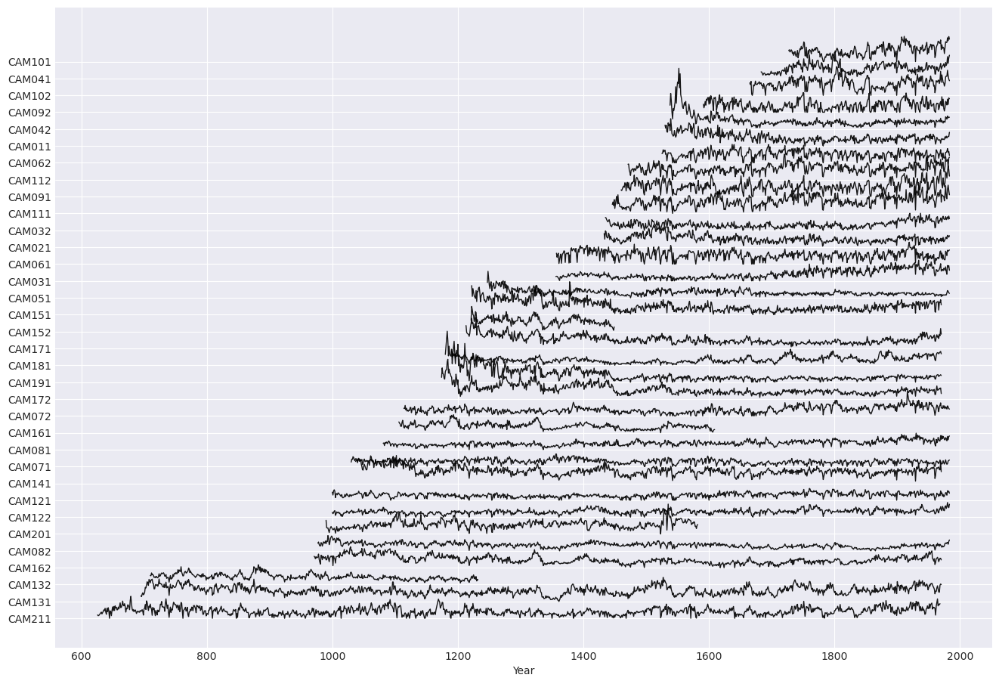
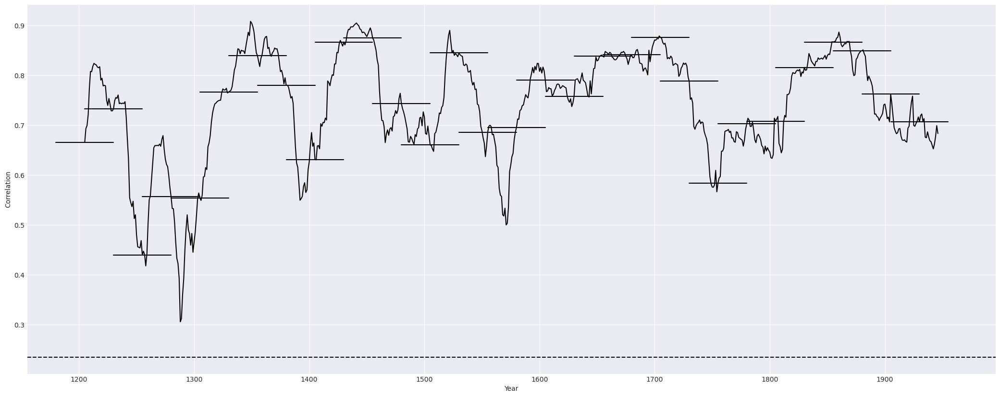
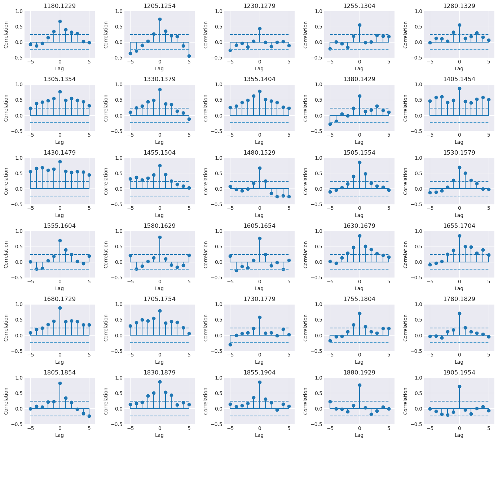
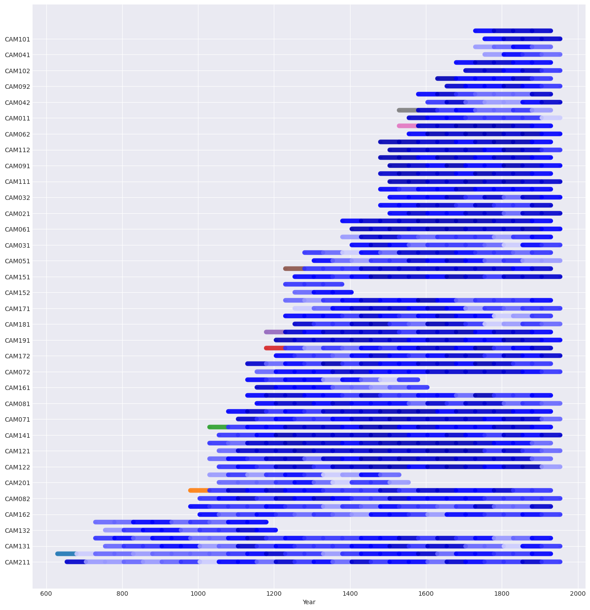

## The dplPy User Manual (Beta)

Welcome to the dplPy manual.

---

### Requirements, Installation and Accessibility

#### Requirements

* Git 
* Python v3.10=< (although functional on Python v3.8=<, we suggest using Python v3.10=<)
* Pip
* [Miniconda3](https://docs.conda.io/en/latest/miniconda.html) (suggestion: select the python 3.10 version that best fits your OS)

Suggested:

* [VSCode](https://code.visualstudio.com/)
* Mamba:[repository](https://github.com/mamba-org/mamba), [anaconda.org link](https://anaconda.org/conda-forge/mamba)

### Installation

DplPy is planned to be released as a `pip` and `conda` packages for easy installation (e.g., `pip install dplpy` or `conda install -c conda-forge dplpy`). However, the current installation process for dplPy requires manual steps to be performed after cloning the GitHub repository.

1. Clone the GitHub repository to your personal machine: `git clone https://github.com/OpenDendro/dplPy.git`; move into the repository `cd dplPy/`
2. Build conda environment: `conda env create -f environment.yml` or `mamba env create -f environment.yml` if Mamba is installed; Activate environment: `conda activate dplpy`

!!! Warning "Known Issues"
    The [CSAPS](https://csaps.readthedocs.io/en/latest/) package, required for smoothing splines, may fail to install in rare occasions. If that is the case, please install CSAPS manually by doing `pip install -U csaps`.

### Accessing dplPy via Jupyter Notebook

Although dplPy is executable from the command line interface (CLI), e.g., BASH, ZSH, or a Cygwin terminal, the usage of Jupyter Notebooks is suggested for visualizing graphs.

!!! tip "Making the dplPy kernel findable"
    It is possible that your computer will not automatically find the dplPy [kernel](https://en.wikipedia.org/wiki/Kernel_(operating_system). If that is the case, execute the following command:
    
    ```
    python -m ipykernel install --user --name dplpy --display-name "Python (dplpy)"
    ```

    This will ensure that the dplPy environment created through conda is findable by Jupyter under the name `Python (dplpy)`.

#### Accessing Jupyter Notebook on Linux, MacOS

1. In your VScode terminal, activate the conda environment with `conda activate dplpy`.
2. From the terminal, execute `jupyter notebook`.
3. If prompted to select a kernel, select `dplpy`. This will automatically load the correct environment.

#### Accessing Jupyter Notebook on Windows

In VScode:

1. In your VSCode terminal window, activate the conda environment with `conda activate dplpy`. 
2. In the same terminal window, start a Jupyter Notebook with `jupyter notebook`. Jupyter will then return URLs that you can copy; *Copy* one of these URLs.
3. When propted to select a kernel (top right), select **Select Another Kernel** > **Existing Jupyter Server** and paste the URL you have copied.
4. Jupyter Notebook will now be able to access the environment created.

---

### Obtain Git

Clone (and move into) the dplPy Git repository with:

```
$ git clone https://github.com/OpenDendro/dplPy.git
$ cd dplPy
```

!!! Note
        The dplPy Git repository contains:

        - source code (`src/`)
        - A jupyter notebook example (`runnable_example.ipynb`)
        - Test files in `csv` and `rwl` formats (`tests/data/<format>/`)
  
### Import the `dplpy` library

dplPy currently exists as a python library; ensure you are in the correct folder prior to execution.

```
import os
directory = os.getcwd().split("/")
if directory[-1] != 'src':
    os.chdir("./src")
import dplpy as dpl
```

---

## Usage

DplPy is currently available as a Python [module](https://docs.python.org/3/tutorial/modules.html) with a number of [functions](https://www.w3schools.com/python/python_functions.asp), which in turn have parameters one can set. Here is a list of functions for dplPy (in alphabetical order):

| Function | Description |
| --- | --- |
| [`ar_func`](#ar_func) | Fits series to autoregressive (AR) models and related functions |
| [`autoreg`](#autoreg) | Fits series to autoregressive (AR) models and related functions |
| [`chron`](#chron) | Creates a mean value chronology for a dataset, typically the ring width indices of a detrended series |
| [`detrend`](#detrend) | Detrends a given series or data frame, first by fitting data to curve(s), with spline(s) as the default, and then by calculating residuals or differences compared to the original data. |
| [`help`](#help) | Displays help (alpha). |
| [`plot`](#plot) | Generates line, spaghetti or segment plots.|
| [`rbar`](#rbar) | Finds best interval of overlapping series over a  period of years, and calculating rbar constant for a dataset over period of overlap. |
| [`readers`](#readers) | Reads data from supported file types (*.CSV and *.RWL) and stores them in dataframe. |
| [`readme`](#readme) | Goes to this website. |
| [`report`](#report) | Generates a report about absent rings in the data set. |
| [`series_corr`](#series_corr) |  Crossdating function that focuses on the comparison of one series to the master chronology. |
| [`stats`](#stats) | Generates summary statistics for RWL and CSV format files. |
| [`summary`](#summary) | Generates a summary for RWL and CSV format files. |
| [`xdate`](#xdate) | Crossdating function for dplPy loaded datasets. |

### `ar_func`

Main function for autoregressive (AR) modeling. Returns residuals and mean of best AR fit with specified lag (default = 5).

!!! info "Usage"
    ```
    >>> dpl.ar_func(<data>["<series>"], <lag number>)
    ```

    Example:
    ```
    >>> dpl.ar_func(ca533["CAM191"], 10) 
    ```

    In the above example, we use dataset look at dataset `ca533` series `CAM191`  and specified a lag of `10`.

!!! Abstract "Expected output(s)"

    Users can expect an array of residual+mean for selected series. 
    
    The expected output from the example above will look similar to this:
    ```
    array([ 0.71130658, -0.23204695,  0.52121028,  0.57597523,  0.90108448,
            0.20495808, -0.23457629,  0.58819405,  0.66478718,  0.47521983,
            0.92695177, -0.35659493,  0.42220031, -0.19197698, -0.08828572,
            0.5320343 ,  0.28471761,  0.39486259,  0.10748019,  0.25214937,
            0.46500727,  1.45016901,  0.28605889,  0.29470389,  0.34120629,
           -0.31249819,  0.42380461,  0.23473108, -0.06796468,  0.38897624,
            0.68666198,  0.77677716,  0.62360082,  0.43398575,  0.74032758,
            0.5880663 ,  0.20567916,  0.23525549,  0.63297387,  0.94101874,
            0.06615244,  0.73838454,  0.51092414,  0.25087689,  0.3873105 ,
            0.48383716,  0.28317419,  0.46750972,  0.60187677,  0.40542752,
            0.54822178,  0.08560112,  0.26122762,  0.13318504,  0.25876284,
            0.56315817,  0.40823334,  0.36114307,  0.49613157,  0.4169329 ,
            0.40733772,  0.25578201,  0.42718681,  0.59555259, -0.21075308,
            0.11587297,  0.62082607,  0.65467697, -0.17674732,  0.56107325,
            0.51825623,  0.58111792,  0.61318262,  0.3742455 ,  0.07211766,
            0.01136486,  0.06596661,  0.32254786,  0.39898574,  0.22616678,
            0.34727753,  0.42409955,  0.51594014,  0.23294973,  0.50911683,
            0.84802911,  0.48218982,  0.393356  ,  0.22153173,  0.65209051,
            0.48231136,  0.19053267,  0.39660363,  0.39800466,  0.29138228,
           -0.030384  ,  0.49157549,  0.49579055,  0.25640508,  0.48196172,
            0.28278419,  0.53502938,  0.41559126,  0.34577752,  0.33023954,
            0.55383387,  0.4391052 ,  0.35063736,  0.20157626,  0.25298519,
            0.51312838,  0.53184596,  0.43997298,  0.27903576,  0.43143646,
            0.45186539,  0.3734363 ,  0.41050279,  0.67168476,  0.31693981,
            0.32281309,  0.5155617 ,  0.51985799,  0.48651392,  0.50650445,
    ...
            0.39541278,  0.47066705,  0.34558178,  0.46008747,  0.34158785,
            0.3672973 ,  0.37749446,  0.34939726,  0.37388067,  0.4241256 ,
            0.23815543,  0.29207569,  0.47247813,  0.44170539,  0.4410876 ,
            0.4007522 ,  0.29655365,  0.38460918,  0.39774193,  0.42761775,
            0.38384653])
    ```

### `autoreg`

Secondary function for AR modeling. Returns parameters of best fit AR model with specified lag (default = 5); Best AR model is selected based on AIC value.

!!! Warning "Note"
    This function and its outputs are integrated in the [`ar_func`](#ar_func) function.

!!! info "Usage" 
    ```
    >>> dpl.autoreg(<data>["<series>"], <lag number>)
    ```

    Example:
    ```
    dpl.autoreg(ca533["CAM191"], 10)
    ```

!!! Abstract "Expected output(s)"

    A table listing autoregressive paramenters for the specified series;

    The expected output from the example above will look similar to this:
    ```
    const         0.022210
    CAM191.L1     0.503373
    CAM191.L2     0.087230
    CAM191.L3     0.143716
    CAM191.L4     0.020119
    CAM191.L5    -0.027769
    CAM191.L6    -0.010029
    CAM191.L7     0.001373
    CAM191.L8     0.025588
    CAM191.L9     0.042340
    CAM191.L10    0.136916
    dtype: float64
    ```
 
### `chron`

Creates a mean value chronology for a dataset, typically the ring width indices of a detrended series. Takes three optional arguments `biweight`, `prewhiten`, and `plot`. They determine whether to find means using tukey's biweight robust mean (default True), whether to prewhiten data by fitting to an AR model (default False), and whether to plot the results of the chronology (default True).

!!! info "Usage" 
    ```
    >>> dpl.chron(<data>, prewhiten=<True/False>, biweight=<True/False>, plot=<True/False>)
    ```

    Example:
    ```
    # Detrending data first
    >>> rwi_data = dpl.detrend(ca533)

    # Creating chronology using detrended data 
    >>> dpl.chron(rwi_ca533, prewhiten=False, biweight=True, plot=True)
    ```

!!! Abstract "Expected output(s)"

    The expected output is the mean value chronology of a specific dataframe.

    The expected output from the example above will look similar to this:
    ```
            Mean RWI	Sample depth
    Year		
    626	    0.371605	1
    627	    0.284398	1
    628	    0.306523	1
    629	    0.416333	1
    630	    0.482462	1
    ...	    ...	        ...
    1979	1.053427	21
    1980	1.455353	21
    1981	1.252526	21
    1982	1.362244	21
    1983	1.314827	21
    1358 rows × 2 columns
    ```

    If `plot=True` then a plot will also be generated:
    
    

### `detrend`

Detrends a given series or dataframe, first by fitting data to curve(s), with `spline` as the default, and then by calculating residuals (default = `residual`) or differences (`difference`) compared to the original data. Other supported curve fitting methods are `ModNegex` (modified negative exponential), `Hugershoff`, `linear`, `horizontal`.

!!! info "Usage" 
    ```
    # Detrend the entire dataframe
    >>> dpl.detrend(<data>)

    # Detrending a series part of the dataframe
    >>> dpl.detrend(<data>["<series>"])

    # Detrending function and its options
    >>> dpl.detrend(<data>["<series>"], fit="<fitting method>", method="<comparison method>", plot=<True/False>) 
    ```

    Example:
    ```
    # Detrending series CAM191 from dataframe ca533, using the spline fitting method and calculating residuals compared to the original data 
    >>> rwi_data = dpl.detrend(ca533["CAM191"], fit="spline", method="residual", plot=True)

    # Creating chronology using detrended data 
    >>> dpl.chron(rwi_ca533, prewhiten=False, biweight=True, plot=True)
    ```
    
!!! Abstract "Expected output(s)"

    The expected output is the a list of detrended values (for the entire dataset or for a specific series)

    The expected output from the example above will look similar to this:
    ```
    1180    1.180835
    1181    1.511543
    1182    1.870558
    1183    2.197630
    1184    1.815025
            ...   
    1966    1.060515
    1967    1.209514
    1968    1.282459
    1969    1.392746
    1970    1.239629
    Name: CAM191, Length: 791, dtype: float64
    ```

    If `plot=True` then a plot will also be generated:
    
    

### `help`

!!! Warning "Under Development"

!!! Info "Usage"
    ```
    >>> dpl.help()
    ```

### `plot`

Plots a given dataframe or series of a specific dataframe in either line (default), spaghetti (`spag`) or segment (`seg`) plots.

!!! info "Usage"
    ```
    # Plot entire data
    >>> dpl.plot(<data>)

    # Plot series subset of dataframe with a specified plot type
    >>> dpl.plot(<data>["<series>"], type=<plot type>)
    ```

    Example:
    ```
    # Plotting entire dataset with a spaghetti plot
    >>> dpl.plot(ca533, type=spag)
    ```

!!! Abstract "Expected output"
    A graph of the specified dataframe.

    From the example above, the expected output would look something similar to the below plot:

    

### `rbar`

Finds best interval of overlapping series over a long period of years and calculates rbar constant for a dataset. Supports a number of rbar methods: `osborn`, `67spline`, `frank`.

!!! Warning "Further development underway. Future versions to prioritize number of series, number of years or both. Current version attempts to do both."

!!! info "Usage"
    ```
    # Detrend data
    >>> rwi_data = dpl.detrend(<data>, plot=False)

    # Find common interval of detrended data
    >>> start, end = dpl.common_interval(<data>)

    # Calculate rbar coonstant
    >>> dpl.rbar(rwi_data, start, end, method="<rbar method>")
    ```

    Example:
    ```
    # Detrend data
    >>> rwi_data = dpl.detrend(ca533, plot=False)

    # Find common interval of detrended data
    >>> start, end = dpl.common_interval(ca533)

    # Calculate rbar coonstant using the interval calculated above and using the Osborn method
    >>> dpl.rbar(rwi_data, start, end, method="osborn")
    ```

!!! Abstract "Expected output"

    rbar returns a list of constants to multiply with each mean value generated for a range of years from a mean value chronology.

    From the example above, the output is the following:
    ```
    [0.44170725878965766,
    0.44170725878965766,
    0.44170725878965766,
    0.44170725878965766,
    0.44170725878965766,
    0.44170725878965766,
    ...
    0.44170725878965766,
    0.44170725878965766,
    0.44170725878965766,
    0.44170725878965766,
    0.44170725878965766]
    ```

### `readers`

Reads data and stores them in a dataframe.

!!! Info "Supported data types"
        dplPy currently supports `csv` and `rwl` data formats.

!!! info "Usage"

    ```
    >>> data = dpl.readers("<path/to/data.format>")
    ```

    Example:
    
    ```
    >>> data  = dpl.readers("ca533.rwl")
    ```

!!! Abstract "Expected output"

    - A success/failure message;
    - A list of series within the data file such as the following:

    ```
    Attempting to read input file: ca533.rwl as .rwl format

    SUCCESS!
    File read as: .rwl file

    Series names:
    ['CAM011', 'CAM021', 'CAM031', 'CAM032', 'CAM041', 'CAM042', 'CAM051', 'CAM061', 'CAM062', 'CAM071', 'CAM072', 'CAM081', 'CAM082', 'CAM091', 'CAM092', 'CAM101', 'CAM102', 'CAM111', 'CAM112', 'CAM121', 'CAM122', 'CAM131', 'CAM132', 'CAM141', 'CAM151', 'CAM152', 'CAM161', 'CAM162', 'CAM171', 'CAM172', 'CAM181', 'CAM191', 'CAM201', 'CAM211'] 
    ```

### `readme`

The readme function opens the [opendendro](https://opendendro.org/) webpage.

!!! info "Usage"
    ```
    >>> dpl.readme()
    ```
### `report`

Generates a report about the input dataset that includes:

- Number of dated series
- Number of measurements
- Avg series length
- Range
- Span
- Mean (Std dev) series intercorrelation
- Mean (Std dev) AR1
- Years with absent rings listed by series

!!! info "Usage"
    ```
    >>> dpl.report(<data>)
    ```

    Example:
    ```
    >>> dpl.report(ca533)
    ```

!!! Abstract "Expected output"
    From the example above, the expected output is the following:

    ```
    Number of dated series: 34
    Number of measurements: 23276
    Avg series length: 684.5882
    Range: 1358
    Span: 626 - 1983
    Mean (Std dev) series intercorrelation:
    Mean (Std dev) AR1: 0.7122
    -------------
    Years with absent rings listed by series

        CAM011 -- 1753 1782
        CAM031 -- 1497 1500 1523 1533 1540 1542 1545 1578 1579 1580 1655 1668 1670 1681
        CAM032 -- 1497 1523 1579 1654 1670 1681 1782
        CAM051 -- 1475
        CAM061 -- 1497 1523 1542 1545 1547 1579 1654 1655 1668 1670 1672 1782 1858 1960
        CAM062 -- 1542 1545 1547 1548 1579 1654 1655 1670 1672 1782 1836 1857 1858 1929
        CAM071 -- 1269 1497 1498 1523 1542 1547 1578 1579 1612 1655 1656 1668 1670 1672 1674 1690 1707 1708 1756 1782 1795 1820 1836 1845 1857 1858 1924 1948 1960
        CAM072 -- 1218 1497 1498 1523 1533 1538 1542 1545 1546 1547 1571 1579 1580 1590 1654 1655 1668 1670 1672 1675 1690
        CAM081 -- 1218 1336
        CAM082 -- 1362 1858 1865
        CAM091 -- 1655 1669 1670 1782 1858
        CAM092 -- 1624 1654 1655 1670 1672 1675 1677 1690 1703 1705 1707 1708 1710 1733 1753 1756 1757 1774 1777 1781 1782 1783 1784 1795 1807 1824 1829 1836 1845 1857 1858 1899 1904 1929 1936 1961
        CAM101 -- 1782 1783 1899 1929
        CAM102 -- 1669 1690 1782 1858 1899 1929
        CAM111 -- 1542
    ...
        CAM201 -- 1523
        CAM211 -- 645 762 809 847 924 957 1014 1118 1123 1133 1147 1189 1350 1384 1468 1571 1641
    -------------
    ```

### `series_corr`

Crossdating function that focuses on the comparison of one series to the master chronology.

!!! info "Usage"
    ```
    >>> dpl.series_corr(<data>, "<series name>", prewhiten=<True/False>, corr="<Pearson/Spearman>", seg_length=<length of segments (default=50)>, bin_floor=<bin size (default=100)>, p_val=<p value (default=0.05)>, plot=<True/False (default=True)> )
    ```

    Example:
    ```
    >>> dpl.series_corr(ca533, "CAM191", prewhiten=False, corr="Pearson", bin_floor=10)
    ```

!!! Abstract "Expected output"
    Two graphs: the first graph showing the correlation of one series to against the master chronology in a line graph; the second graph supports the first, showing the correlation in segments. For the example above, the graphs are as following:

    
    

### `stats`

Generates summary statistics for `rwl`  and `csv` format files. It outputs a table with `first`, `last`, `year`, `mean`, `median`, `stdev`, `skew`, `gini`, `ar1` for each series in data file.

!!! info "Usage"
    ```
    >>> dpl.stats(<data>)
    ```

    Example:
    ```
    >>> dpl.stats(ca533)
    ```

!!! Abstract "Expected output"

    Table with `first`, `last`, `year`, `mean`, `median`, `stdev`, `skew`, `gini`, `ar1` for each series in data file. For the example above, the output table is the following:

    ```
    	series	first	last	year	mean	median	stdev	skew	gini	ar1
    1	CAM011	1530	1983	454	    0.440	0.40	0.222	1.029	0.273	0.698
    2	CAM021	1433	1983	551	    0.424	0.40	0.185	0.946	0.237	0.702
    3	CAM031	1356	1983	628	    0.349	0.29	0.214	0.690	0.341	0.809
    4	CAM032	1435	1983	549	    0.293	0.26	0.163	0.717	0.309	0.665
    5	CAM041	1683	1983	301	    0.526	0.53	0.223	0.488	0.238	0.710
    6	CAM042	1538	1983	446	    0.439	0.36	0.348	3.678	0.324	0.881
    7	CAM051	1247	1983	737	    0.273	0.25	0.140	1.836	0.262	0.705
    8	CAM061	1357	1983	627	    0.462	0.47	0.202	-0.111	0.247	0.510
    9	CAM062	1525	1983	459	    0.442	0.45	0.188	-0.266	0.240	0.529
    10	CAM071	1037	1983	947	    0.249	0.25	0.109	0.027	0.247	0.578
    11	CAM072	1114	1983	870	    0.309	0.29	0.163	0.698	0.292	0.735
    12	CAM081	1081	1983	903	    0.327	0.31	0.124	0.555	0.211	0.723
    13	CAM082	977	    1983	1007	0.285	0.29	0.114	0.312	0.223	0.771
    14	CAM091	1460	1983	524	    0.532	0.52	0.255	0.425	0.267	0.632
    15	CAM092	1591	1983	393	    0.349	0.34	0.226	0.337	0.369	0.561
    16	CAM101	1727	1983	257	    0.568	0.56	0.260	0.254	0.259	0.716
    17	CAM102	1665	1983	319	    0.604	0.62	0.261	0.082	0.243	0.677
    18	CAM111	1446	1983	538	    0.625	0.62	0.249	0.196	0.225	0.625
    19	CAM112	1471	1983	513	    0.570	0.56	0.211	0.223	0.207	0.583
    20	CAM121	1000	1983	984	    0.259	0.26	0.106	0.042	0.231	0.594
    21	CAM122	1000	1983	984	    0.271	0.27	0.109	0.346	0.223	0.653
    22	CAM131	695	    1970	1276	0.552	0.53	0.198	0.330	0.202	0.788
    23	CAM132	710	    1232	523	    0.397	0.38	0.148	0.871	0.203	0.810
    24	CAM141	1030	1970	941	    0.627	0.60	0.204	0.695	0.177	0.746
    25	CAM151	1222	1970	749	    0.446	0.39	0.273	1.068	0.332	0.765
    26	CAM152	1221	1449	229	    0.534	0.52	0.195	0.297	0.203	0.695
    27	CAM161	1106	1609	504	    0.339	0.33	0.149	0.633	0.243	0.794
    28	CAM162	971	    1970	1000	0.397	0.37	0.184	0.647	0.259	0.840
    29	CAM171	1213	1970	758	    0.450	0.40	0.210	1.250	0.250	0.799
    30	CAM172	1174	1970	797	    0.482	0.42	0.249	1.622	0.268	0.847
    31	CAM181	1190	1970	781	    0.283	0.25	0.149	0.706	0.293	0.805
    32	CAM191	1180	1970	791	    0.366	0.25	0.336	2.359	0.429	0.876
    33	CAM201	990	    1582	593	    0.474	0.47	0.181	0.772	0.208	0.709
    34	CAM211	626	    1968	1343	0.357	0.34	0.182	0.513	0.286	0.683
    ```

### `summary`

The summary function generates a summary of each series recorded in `rwl`  and `csv` format files. It outputs a table with `count`, `mean`, `std`, `min`, `25%`, `50%`, `75%`, `max` for each series in data file.

!!! Info "Usage"
    ```
    >>> dpl.summary(<data>)
    ```

    Example:
    ```
    dpl.summary(ca533)
    ```

!!! Abstract "Expected output"

    Summary outputs a table with `count`, `mean`, `std`, `min`, `25%`, `50%`, `75%`, `max` for each series in data file. For the example above, the output table is the following:
    ```
    	    CAM011	    CAM021	    CAM031	    CAM032	    CAM041	    CAM042	    CAM051	    CAM061	    CAM062	    CAM071	    ...	CAM151	    CAM152	    CAM161	    CAM162	    CAM171	    CAM172	    CAM181	    CAM191	    CAM201	    CAM211
    count	454.000000	551.000000	628.000000	549.000000	301.000000	446.000000	737.000000	627.000000	459.000000	947.000000	...	749.000000	229.000000	504.000000	1000.000000	758.000000	797.000000	781.000000	791.000000	593.000000	1343.000000
    mean	0.439581	0.424465	0.349156	0.293224	0.525648	0.439148	0.273012	0.462281	0.441939	0.249071	...	0.445648	0.533799	0.339464	0.396710	0.450264	0.482296	0.282638	0.366271	0.473929	0.356813
    std	    0.221801	0.185397	0.213666	0.162930	0.222568	0.347705	0.139691	0.201785	0.188389	0.109357	...	0.272561	0.194947	0.148916	0.184057	0.209848	0.249002	0.148853	0.335788	0.180967	0.182086
    min	    0.000000	0.050000	0.000000	0.000000	0.100000	0.070000	0.000000	0.000000	0.000000	0.000000	...	0.000000	0.060000	0.000000	0.000000	0.080000	0.080000	0.000000	0.000000	0.000000	0.000000
    25%	    0.290000	0.290000	0.180000	0.180000	0.350000	0.270000	0.180000	0.335000	0.330000	0.180000	...	0.240000	0.410000	0.230000	0.260000	0.300000	0.310000	0.170000	0.170000	0.350000	0.220000
    50%	    0.400000	0.400000	0.290000	0.260000	0.530000	0.360000	0.250000	0.470000	0.450000	0.250000	...	0.390000	0.520000	0.330000	0.370000	0.400000	0.420000	0.250000	0.250000	0.470000	0.340000
    75%	    0.540000	0.520000	0.510000	0.390000	0.680000	0.460000	0.330000	0.600000	0.580000	0.320000	...	0.610000	0.660000	0.430000	0.510000	0.580000	0.590000	0.380000	0.455000	0.580000	0.470000
    max	    1.360000	1.110000	1.030000	0.850000	1.380000	3.030000	1.320000	1.090000	0.920000	0.620000	...	1.640000	1.250000	0.900000	1.040000	1.540000	1.980000	0.800000	2.540000	1.490000	1.100000
    ```

### `xdate`

Crossdating function for dplPy datasets. 

!!! info "Usage"
    ```
    dpl.xdate(<detrended data>, prewhiten=<True/False>, corr="<Pearson/Spearman>", slide_period=<slide period window (default=50)>, bin_floor=<bin size (default=100)>, p_val=<p value (default=0.05)>, show_flags=<True/False (default=True)>)
    ```

    Example:
    ```
    # Detrend data first
    ca533_rwi = dpl.detrend(ca533, fit="spline", method="residual", plot=False)

    # Crossdating of detrended data
    dpl.xdate(ca533_rwi, prewhiten=True, corr="Spearman", slide_period=50, bin_floor=100, p_val=0.05, show_flags=True)
    ```

!!!! Abstract "Expected outputs"

    Outputs a dataframe of each series' segment correlations compared to the same segments in the master chronology.

    For the above example, the expect output dataframe is the following:
    ```
    Flags for CAM011
    [B] Segment  High   -10    -9    -8    -7    -6    -5    -4    -3    -2    -1     0    +1    +2    +3    +4    +5    +6    +7    +8    +9   +10
    1900-1949    6 -0.03 -0.31  0.17 -0.17  0.03 -0.18 -0.15  0.09 -0.16  0.20  0.15 -0.08 -0.03  0.08  0.13 -0.06  0.30  0.20 -0.17  0.09 -0.04

    Flags for CAM051
    [B] Segment  High   -10    -9    -8    -7    -6    -5    -4    -3    -2    -1     0    +1    +2    +3    +4    +5    +6    +7    +8    +9   +10
    1375-1424    9 -0.02 -0.21  0.29  0.10 -0.09  0.06  0.30  0.09 -0.01 -0.03  0.18 -0.03 -0.16  0.24 -0.05 -0.06 -0.03  0.03 -0.11  0.38 -0.11

    Flags for CAM131
    [A] Segment  High   -10    -9    -8    -7    -6    -5    -4    -3    -2    -1     0    +1    +2    +3    +4    +5    +6    +7    +8    +9   +10
    1800-1849    0 -0.13 -0.13 -0.05  0.05  0.09 -0.03 -0.14 -0.16 -0.00 -0.25  0.13 -0.11  0.10 -0.15  0.01 -0.34  0.09 -0.01  0.09 -0.09  0.05

    Flags for CAM171
    [B] Segment  High   -10    -9    -8    -7    -6    -5    -4    -3    -2    -1     0    +1    +2    +3    +4    +5    +6    +7    +8    +9   +10
    1275-1324   -4 -0.04  0.00 -0.11  0.01 -0.05 -0.05  0.46  0.27 -0.13  0.02  0.28  0.23  0.01  0.20  0.12 -0.04  0.03 -0.14  0.01  0.01 -0.13

    Flags for CAM181
    [B] Segment  High   -10    -9    -8    -7    -6    -5    -4    -3    -2    -1     0    +1    +2    +3    +4    +5    +6    +7    +8    +9   +10
    1775-1824    8 -0.13  0.05  0.07 -0.06 -0.12  0.19  0.14 -0.36 -0.30  0.06  0.21 -0.02 -0.15  0.16  0.14 -0.05 -0.02 -0.01  0.31  0.05 -0.14

    Flags for CAM201
    [A] Segment  High   -10    -9    -8    -7    -6    -5    -4    -3    -2    -1     0    +1    +2    +3    +4    +5    +6    +7    +8    +9   +10
    1350-1399   -7 -0.04  0.03 -0.05  0.25 -0.08 -0.09 -0.13  0.01 -0.08  0.22  0.19  0.17 -0.13  0.13  0.09 -0.14 -0.26  0.03 -0.15 -0.14  0.12
    [B] Segment  High   -10    -9    -8    -7    -6    -5    -4    -3    -2    -1     0    +1    +2    +3    +4    +5    +6    +7    +8    +9   +10
    1125-1174    1 -0.02 -0.03 -0.12 -0.17 -0.08  0.08  0.18  0.00  0.19 -0.27  0.28  0.39  0.12 -0.24  0.01 -0.06 -0.15 -0.00 -0.10 -0.14 -0.18
    ...
    1000-1049   -1  0.04  0.07 -0.16 -0.06  0.09 -0.07 -0.24 -0.12 -0.04  0.45  0.30 -0.33 -0.14  0.06  0.18 -0.06 -0.27 -0.25  0.09  0.12  0.16
    1025-1074   -1  0.02 -0.19 -0.08 -0.08 -0.20 -0.09 -0.18 -0.18  0.19  0.70  0.36 -0.15 -0.01  0.08 -0.13 -0.34 -0.27 -0.14 -0.04  0.11  0.15

    # Dataframe is truncated for visualization purposes
    	        CAM011	    CAM021	    CAM031	    CAM032	    CAM041	    CAM042	    CAM051	    CAM061	    CAM062	    CAM071	    ...	CAM151	    CAM152  CAM161	CAM162	    CAM171	    CAM172	    CAM181	    CAM191	    CAM201	CAM211
    700-749	    NaN	        NaN 	    NaN     	NaN     	NaN     	NaN     	NaN	        NaN     	NaN     	NaN     	...	NaN     	NaN 	NaN 	NaN     	NaN     	NaN	        NaN     	NaN     	NaN 	0.402641
    725-774	    NaN	        NaN 	    NaN     	NaN     	NaN     	NaN     	NaN	        NaN     	NaN     	NaN     	...	NaN     	NaN 	NaN 	NaN     	NaN     	NaN	        NaN     	NaN     	NaN 	0.459880
    750-799	    NaN	        NaN 	    NaN     	NaN     	NaN     	NaN     	NaN	        NaN     	NaN     	NaN     	...	NaN     	NaN 	NaN 	NaN     	NaN     	NaN	        NaN     	NaN     	NaN 	0.303433
    1775-1824	0.482449	0.526435	0.294118	0.646002	0.451140	0.489364	0.455558	0.777575	0.862473	0.772677	...	0.702473	NaN	    NaN	    0.484946	0.572821	0.578103	0.208547	0.764706	NaN	    0.544202
    1800-1849	0.522305	0.456999	0.308715	0.568499	0.581273	0.485234	0.607107	0.790732	0.810612	0.761633	...	0.782953	NaN	    NaN 	0.532389	0.523073	0.749052	0.256567	0.810900	NaN	    0.568980
    1825-1874	0.545834	0.575606	0.546987	0.625834	0.655030	0.514622	0.572533	0.793421	0.747419	0.652533	...	0.707275	NaN	    NaN	    0.494070	0.535942	0.700264	0.411092	0.736471	NaN	    0.503770
    1850-1899	0.538631	0.738295	0.656855	0.714382	0.652629	0.655414	0.402929	0.859112	0.801489	0.674430	...	0.692101	NaN	    NaN	    0.567827	0.538151	0.672989	0.513661	0.749436	NaN	    0.660120
    1875-1924	0.302665	0.751164	0.533637	0.640816	0.461801	0.604994	0.425498	0.709196	0.716879	0.653493	...	0.689508	NaN	    NaN	    0.717551	0.542185	0.692869	0.554094	0.679136	NaN	    0.683361
    1900-1949	0.153806	0.700456	0.640816	0.696230	0.465738	0.728307	0.385162	0.647155	0.718703	0.493013	...	0.730612	NaN	    NaN	    0.628523	0.575222	0.751068	0.423866	0.728307	NaN	    0.566963
    1925-1974	0.288836	0.618439	0.560912	0.688547	0.509724	0.637935	0.354238	0.696711	0.813205	0.529220	...	NaN	        NaN	    NaN 	NaN	        NaN	        NaN	        NaN	        NaN	        NaN	    NaN
    ```

### `xdate_plot`

!!! Warning "Function is under construction"

Visualize crossdating function in plot form; Each segment correlation is color coded. 

!!! Info "Usage"
    ```
    dpl.xdate_plot(<data>)
    ```

    Example:
    ```
    # Detrend data first
    ca533_rwi = dpl.detrend(ca533, fit="spline", method="residual", plot=False)

    # Crossdating of detrended data
    dpl.xdate_plot(ca533_rwi)
    ```

!!! Abstract "Expected output"
    A graph showing segment correlations.

    

---

## Development & Future plans

We encourage community contributions through our [GitHub](https://github.com/opendendro/dplPy), feel free to create Issues and Pull Requests. We are planning a PyPi release in order to streamline installation. Stay tuned!